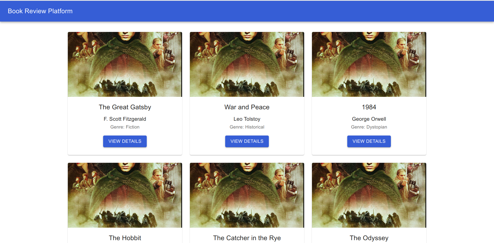

# Book Review Platform

## Introduction

The Book Review Platform is a full-stack web application that allows users to browse, review, and rate books. Built using Django for the backend and React for the frontend, this platform offers a seamless user experience for book enthusiasts to share their opinions. The application includes a comprehensive review system with an interactive user interface that displays book details, customer reviews, and rating distributions.

## API Documentation

### 1. **GET /books**
   - **Description**: Fetches a list of all books in the system.
   - **Endpoint**: `/books`
   - **Response Example**:
     ```json
     [
       {
         "id": 1,
         "title": "The Great Gatsby",
         "author": "F. Scott Fitzgerald",
         "genre": "Fiction",
         "published_date": "1925-04-10"
       },
       {
         "id": 2,
         "title": "To Kill a Mockingbird",
         "author": "Harper Lee",
         "genre": "Fiction",
         "published_date": "1960-07-11"
       }
     ]
     ```

### 2. **GET /books/{id}/reviews**
   - **Description**: Fetches all reviews for a specific book by its ID.
   - **Endpoint**: `/books/{id}/reviews`
   - **Response Example**:
     ```json
     [
       {
         "reviewer_name": "John Doe",
         "review_text": "An amazing read!",
         "rating": 5
       },
       {
         "reviewer_name": "Jane Smith",
         "review_text": "Quite interesting.",
         "rating": 4
       }
     ]
     ```

### 3. **POST /books/{id}/review/add**
   - **Description**: Submits a new review for a specific book by its ID.
   - **Endpoint**: `/books/{id}/review/add`
   - **Request Body Example**:
     ```json
     {
       "reviewer_name": "Alice Brown",
       "review_text": "A thought-provoking book.",
       "rating": 4
     }
     ```
   - **Response Example**:
     ```json
     {
       "message": "Review added successfully!"
     }
     ```

## Installation & Prerequisites

### 1. **Setup Django Backend**
   - **Prerequisites**:
     - Python >= 3.8.10
     - pip >= 20.0.2
   - **Installation**:
     ```bash
     cd book_review_platform/
     chmod +x setup_django.sh
     ./setup_django.sh
     ```

### 2. **Setup React Frontend**
   - **Prerequisites**:
     - npm >= 10.5.0
     - node >= 21.7.1
   - **Installation**:
     ```bash
     cd book-review-platform-frontend/
     chmod +x setup_react.sh
     ./setup_react.sh
     ```

## Architecture Diagram

The following diagram represents the 3-tier architecture of the Book Review Platform using AWS services:


## Screenshots



